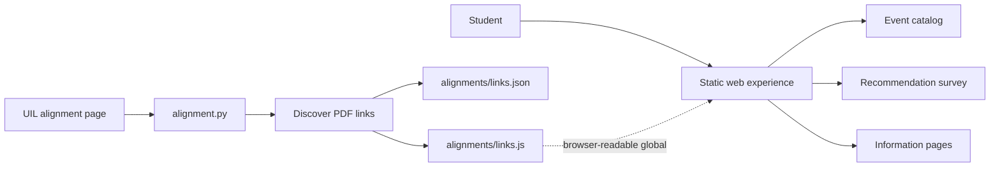

<div align="center">

<sub>Real photography by <a href="https://unsplash.com/photos/focused-student-studying-at-a-library-table-with-a-laptop-NASjMHJ9OhI">Ashutosh Gupta on Unsplash</a>.</sub>

# UIL Prep App
### A polished academic-preparation hub for discovering events, finding a fit, and reaching official study resources.


[Experience](#experience) · [Architecture](#architecture) · [Resource discovery](#resource-discovery) · [Setup](#run-locally)
</div>

---

## Overview

UIL Prep App is a static, browser-first learning portal for students exploring University Interscholastic League academic events. It combines an animated landing experience, a browsable event catalog, an interest-based recommendation survey, and a lightweight Python utility that discovers the current official alignment PDF links.

The repository demonstrates both product thinking and practical integration work: the public experience stays fast and hosting-agnostic, while source discovery is isolated into a small script that emits browser-readable JSON and JavaScript.

## Experience

- **Guided entry points** — move directly into event discovery or the recommendation survey.
- **Event catalog** — explore academic competitions through dedicated cards and descriptions.
- **Fit survey** — answer interest questions and receive suggested events in the browser.
- **Animated presentation** — GSAP-driven motion and responsive styling create a deliberate, modern interface.
- **Official alignment discovery** — collect the current 1A–6A PDF links from the UIL source page.
- **Static delivery** — the frontend needs no application server or database.

## Architecture



The separation is intentional: static pages own the student experience, while Python handles the one task that benefits from server-side HTML parsing.

## Resource discovery

`alignment.py` performs a focused extraction workflow:

1. Requests the configured UIL source page.
2. Locates the primary content wrapper and its first list of PDF links.
3. Keeps the six conference alignments from 1A through 6A.
4. Sorts the results by conference.
5. Writes the same source data in two formats:
   - `links.json` for tools and services.
   - `links.js` as a `window` global that also works when pages are opened directly from disk.

```bash
python alignment.py --out-dir alignments
```

Add `--open` to launch the discovered links after extraction:

```bash
python alignment.py --out-dir alignments --open
```

> [!IMPORTANT]
> The current weekly GitHub Actions file calls `alignment.py` with `--pdf-dir` and `--json-dir`, but the script currently accepts `--out-dir` and `--open`. The workflow therefore needs its arguments aligned with the script before scheduled refreshes can succeed. The script discovers PDF URLs; it does not currently download or parse the PDFs.

## Run locally

### Frontend

No build step is required.

```bash
python -m http.server 8000
```

Open `http://localhost:8000` and navigate through the site.

### Alignment utility

```bash
python -m venv .venv
source .venv/bin/activate
pip install -r requirements.txt
python alignment.py --out-dir alignments
```

Windows activation:

```powershell
.venv\Scripts\activate
```

## Repository map

```text
UILprepApp/
├── index.html           # Landing page and primary navigation
├── info.html            # Program information
├── events.html          # Academic event catalog
├── survey.html          # Interest-based recommendation flow
├── script.js            # Shared interaction and animation logic
├── styles.css           # Responsive visual system
├── alignment.py         # Live UIL alignment-link discovery
├── alignments/          # Generated browser and JSON link indexes
├── requirements.txt     # Python dependencies
└── .github/workflows/   # Weekly resource-refresh automation
```

## Engineering decisions

| Decision | Benefit | Tradeoff |
|---|---|---|
| Static frontend | Fast, inexpensive, and easy to host | Dynamic behavior must remain client-side |
| JSON plus JavaScript output | Supports tooling and direct-file browser use | Two generated representations must stay synchronized |
| Link discovery instead of hardcoding | Adapts when UIL updates document URLs | Depends on the source page's markup |
| Separate scraper utility | Keeps network work out of the UI | Requires a refresh step |
| GSAP motion layer | Adds strong visual polish | Introduces a third-party browser dependency |

## Skills demonstrated

`Responsive UI` · `Vanilla JavaScript` · `Information architecture` · `Recommendation logic` · `HTML parsing` · `Python CLI design` · `JSON interchange` · `Workflow automation` · `Source integration`

## Resume-ready highlight

> Built a responsive UIL academic-preparation portal with event discovery, an interactive recommendation survey, animated UX, and a Python resource-indexing utility that converts changing official source links into browser-ready structured data.

---

<div align="center">
Built to make academic competition easier to discover—and easier to begin.
</div>
